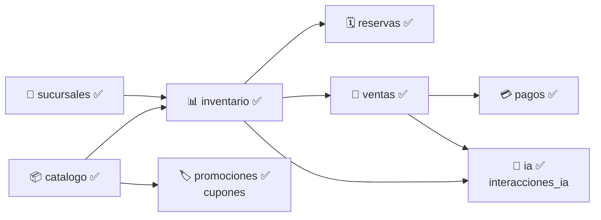

# 🪞 MirrorIA Backend — Arquitectura y Convenciones

Fuente de verdad técnica exclusiva de `mirroria-backend`. El `AGENTS.md` de la raíz del
repo (`../AGENTS.md`) solo enlaza para acá y hacia `mirroria-frontend/AGENTS.md`. El diseño
de base de datos completo (23 tablas, DBML) vive en el vault, no acá:
`/mnt/c/Users/lmc/Documents/Obsidian/U/2-2026/SI2/Parcial1/Database/Diseño_BD.md`.

## Stack

NestJS 12 (Node 24, TypeScript 6, **ESM real** — no CommonJS), TypeORM 1.x + PostgreSQL 16,
Passport + JWT (`passport-jwt`), `class-validator`/`class-transformer`, `bcrypt`, Swagger
(`@nestjs/swagger`), Vitest (no Jest — así lo trae el Nest CLI actual).

> [!IMPORTANT]
> **Este proyecto es ESM puro** (`"type": "module"` en `package.json`, `tsconfig.json` con
> `module`/`moduleResolution: nodenext`). Todo import **relativo** dentro de `src/` debe
> terminar en `.js` (no `.ts`), aunque el archivo real sea `.ts` — es la convención de
> TypeScript para ESM con `nodenext`, y el build falla sin ella. Ejemplo correcto:
> `import { Usuario } from '../entities/usuario.entity.js';`. Los imports de paquetes de
> npm (`@nestjs/common`, `typeorm`, etc.) van sin extensión, como siempre.

## 🏛️ Arquitectura: Monolito Modular (Package-by-Feature), igual criterio que `erp-backend`

```text
src/
├── main.ts                    # bootstrap: prefijo /api/v1, CORS, ValidationPipe, filtro global, Swagger en /api/docs
├── app.module.ts               # wiring: Config + TypeORM + los 10 módulos de negocio
├── app.controller.ts           # GET /api/v1/health (health-check, no "Hello World")
├── app.service.ts
│
├── core/                        # 🌐 Infraestructura transversal — CERO lógica de negocio,
│   │                             # y CERO import de nada bajo modules/ (ver regla de desacoplo abajo)
│   ├── config/
│   │   ├── typeorm.config.ts    # factory de TypeOrmModuleOptions (lee ConfigService)
│   │   └── cors.config.ts       # orígenes permitidos vía env CORS_ORIGINS
│   ├── database/
│   │   └── base.entity.ts       # BaseEntity abstracta: id uuid (gen_random_uuid), createdAt, updatedAt
│   ├── security/
│   │   ├── jwt-payload.interface.ts
│   │   ├── jwt-auth.guard.ts    # @UseGuards(JwtAuthGuard) — genérico, reutilizable por cualquier módulo
│   │   ├── roles.decorator.ts   # @Roles('ADMIN', ...)
│   │   ├── roles.guard.ts       # exige @UseGuards(JwtAuthGuard, RolesGuard) en ese orden
│   │   ├── current-user.decorator.ts  # @CurrentUser() user: JwtPayload
│   │   └── express.d.ts         # augmenta Request.user con JwtPayload
│   └── exception/
│       ├── business.exception.ts           # base abstracta de toda excepción de negocio
│       ├── recurso-no-encontrado.exception.ts  # 404
│       ├── recurso-duplicado.exception.ts      # 409
│       └── global-exception.filter.ts      # @Catch() global — shape { status, message, timestamp }
│
└── modules/                     # 📦 Un módulo por subdominio de negocio (mapea 1:1 a los
                                  # TableGroups de Diseño_BD.md en el vault)
    ├── seguridad/                # ✅ implementado — auth (registro/login/perfil)
    ├── proveedores/               # ✅ implementado — proveedores (CRUD mínimo: crear + listar)
    ├── catalogo/                  # ✅ implementado — categorias, temporadas, colecciones, tallas, colores, productos, variantes_producto
    ├── sucursales/                # ✅ implementado — ciudades, sucursales
    ├── inventario/                # ✅ implementado — inventario_sucursal, movimientos_inventario, ordenes_compra
    ├── reservas/                  # ✅ implementado — reservas, reserva_items (RF09-12, transiciones de estado, integración con ventas)
    ├── ventas/                    # ✅ implementado — carritos, ventas, venta_items
    ├── promociones/               # ✅ implementado — cupones (porcentuales y monto fijo, validación y consumo en ventas)
    ├── pagos/                     # ✅ implementado — pagos (RF19: Stripe con webhook firmado + cobro manual QR/efectivo)
    └── ia/                        # ✅ implementado — interacciones_ia, reportes dinamicos (CU24)
```

Cada módulo `🚧 placeholder` hoy es solo un `<nombre>.module.ts` con `@Module({})` vacío,
importado en `app.module.ts` (para que el árbol de la app ya refleje la arquitectura final)
y con un comentario `TODO` apuntando a la sección correspondiente de `Diseño_BD.md`.

## 📂 Convención interna de cada módulo (una vez implementado)

Mismo criterio de `erp-backend`/`case-backend`, adaptado a NestJS — carpeta por **capa
técnica**, nunca archivos sueltos en la raíz del módulo. `modules/seguridad/` es la
referencia real a copiar:

```text
modules/<nombre_modulo>/
├── <nombre_modulo>.module.ts   # @Module: imports/controllers/providers/exports
├── controller/                 # @Controller(), rutas bajo /api/v1/<modulo>/...
├── dto/                        # clases con class-validator (@IsString, @IsUUID, etc.)
├── entities/                   # @Entity() de TypeORM, extienden core/database/base.entity.ts
├── exception/                  # excepciones específicas del dominio (extienden BusinessException)
├── security/                   # solo si el módulo tiene su propia Strategy (caso de seguridad/)
└── service/                    # lógica de negocio, @Injectable(), inyecta @InjectRepository()
```

No existe carpeta `repository/`: a diferencia de Spring/JPA, en TypeORM el patrón repositorio
ya lo da `@InjectRepository(Entidad)` dentro del `service/` — no hace falta una interfaz propia
salvo que un módulo necesite queries muy custom (ahí sí, un `repository/` con un
`@EntityRepository`/repositorio custom es válido).

## 🛡️ Reglas invariables (mismo espíritu que erp-backend, adaptado)

1. **Desacoplamiento entre módulos de negocio:** ningún módulo bajo `modules/` importa una
   `entity`, `service` o `controller` de otro módulo de negocio directamente. Si un módulo
   necesita un dato de otro (ej. `ventas` necesita saber el `sucursal_id` de `seguridad`),
   se guarda como **columna simple** (uuid) sin relación `@ManyToOne` cruzando módulos — así
   se hizo ya en `Usuario.sucursalId` (ver `entities/usuario.entity.ts`). Cuando el proyecto
   crezca más allá del examen y se necesite reaccionar a eventos entre módulos (ej. una venta
   confirmada que descuenta inventario), usar `EventEmitterModule` de `@nestjs/event-emitter`
   — no inyectar servicios de otro módulo directo (análogo a `ApplicationEventPublisher` en
   erp-backend).
2. **`core/` nunca importa nada de `modules/`.** La única excepción real de este proyecto es
   `JwtStrategy`, que sí necesita conocer `Usuario` para revalidar contra BD — por eso
   **no** vive en `core/security/`, vive en `modules/seguridad/security/jwt.strategy.ts`.
   `core/security/jwt-auth.guard.ts` es agnóstico (solo `extends AuthGuard('jwt')`) y sí es
   reutilizable desde cualquier módulo.
3. **Nunca exponer entidades `@Entity` directo en un controller.** Los controllers reciben y
   devuelven DTOs (`dto/*.dto.ts`), nunca la entidad de TypeORM.
4. **Todas las excepciones de negocio extienden `BusinessException`** (`core/exception/`), no
   se lanza `HttpException` genérica desde un `service`. El `GlobalExceptionFilter` da el
   shape único de error a toda la API: `{ status, message, timestamp }`.
5. **`id` siempre `uuid` con default `gen_random_uuid()`**, nunca `uuid_generate_v4()`
   (extensión `uuid-ossp`, la que usa TypeORM por defecto con `@PrimaryGeneratedColumn('uuid')`
   — por eso `BaseEntity` usa `@PrimaryColumn('uuid', { default: () => 'gen_random_uuid()' })`
   en su lugar). Ver nota siguiente.
6. **Todo `Entity` extiende `core/database/base.entity.ts`** (da `id`, `createdAt`,
   `updatedAt`). Simplificación consciente frente al diseño del vault: `refresh_tokens` ahí
   documenta solo `created_at`, acá también recibe `updatedAt` por venir gratis de la base
   compartida — columna sin uso real, no rompe nada.
7. **Roles válidos de `usuarios.role`:** `CUSTOMER | ADMIN | ENCARGADO_SUCURSAL | CAJERO`
   (enum `RolUsuario` en `modules/seguridad/entities/usuario.entity.ts`). Endpoint restringido
   por rol: `@UseGuards(JwtAuthGuard, RolesGuard)` + `@Roles('ADMIN')` sobre el método.
8. **Catálogo exclusivamente de moda femenina** (decisión del usuario, no del enunciado): no
   agregar campo/tabla de género a `productos` ni a ninguna entidad de `catalogo/`.

## 🔧 Decisión real (2026-09-12): `gen_random_uuid()` vs `uuid_generate_v4()`

Al levantar el proyecto por primera vez con `@PrimaryGeneratedColumn('uuid')` (el default
"obvio" de TypeORM para PK uuid), TypeORM creó solo la extensión `uuid-ossp` y usó
`uuid_generate_v4()` como default de columna — funciona, pero **no coincide** con el diseño
documentado en el vault (`Diseño_BD.md`/`dbdiagram.dbml`), que especifica `pgcrypto` +
`gen_random_uuid()` explícitamente en todas las tablas. Se cambió `BaseEntity` para usar
`@PrimaryColumn('uuid', { default: () => 'gen_random_uuid()' })` en vez del generador
automático, y se agregó `db/init/001-extensions.sql` en la raíz del monorepo (mount de
`docker-entrypoint-initdb.d`) para que `pgcrypto` quede creado automáticamente la primera vez
que se levanta el volumen de Postgres. Verificado end-to-end: `CREATE TABLE "usuarios" (...
DEFAULT gen_random_uuid() ...)` en el log de arranque.

## 🔧 Gotcha real (2026-09-12): columnas nullable de tipo string necesitan `type` explícito

Al armar `Proveedor`/`Producto`/`Color` con campos como `nit!: string | null` y
`@Column({ length: 30, nullable: true })` (sin `type`), TypeORM tira
`DataTypeNotSupportedError: Data type "Object" ... is not supported`: con un tipo unión
(`string | null`) el metadata de diseño de TypeScript que lee `emitDecoratorMetadata` ya no es
`String`, es `Object`, y TypeORM no puede inferir la columna Postgres a partir de eso. **Toda
columna nullable de tipo string necesita `type: 'varchar'` (o el que corresponda) explícito en
las opciones de `@Column`**, no alcanza con inferirlo del tipo de TypeScript. Ejemplo correcto:
`@Column({ type: 'varchar', length: 30, nullable: true }) nit!: string | null;`. Las columnas
`not null` (`string` a secas, sin `| null`) sí se infieren bien sin este problema.

## ✅ Estado actual: `modules/seguridad/` (único módulo real)

- **Entidades:** `Usuario` (tabla `usuarios`: email único, password_hash, full_name, role,
  sucursal_id nullable, is_active) y `RefreshToken` (tabla `refresh_tokens`: token único,
  expires_at, revoked, `@ManyToOne` a `Usuario` con `onDelete: CASCADE`). El flujo de refresh
  token en sí (rotación, endpoint `/refresh`) **no está implementado todavía** — la entidad
  existe pero `AuthService` hoy solo emite `accessToken` (JWT de 1h, sin rotación).
- **Endpoints (`/api/v1/seguridad/auth`):**
  - `POST /register` (público) — crea usuario con `role: CUSTOMER` siempre. Igual que en
    erp-backend/case-backend, es la vía de **bootstrap/desarrollo**; en producción real el
    alta de personal interno (ADMIN/ENCARGADO_SUCURSAL/CAJERO) debería quedar detrás de un
    endpoint protegido por rol ADMIN, no de este registro público.
  - `POST /login` (público) — valida con `bcrypt.compare`, devuelve el mismo shape que
    `register` (`AuthResponseDto`: `accessToken` + `usuario`).
  - `GET /me` (protegido, `JwtAuthGuard`) — perfil del usuario autenticado.
- **JwtStrategy revalida contra BD en cada request** (no solo confía en la firma del token):
  si el usuario fue desactivado (`is_active = false`) o borrado, el token deja de servir de
  inmediato aunque no haya expirado. Trade-off consciente: una query extra por request
  autenticado, aceptable para el volumen de un examen/MVP.
- **Verificado end-to-end (2026-09-12)** contra Postgres real (docker, puerto 5435 en host):
  registro → 201 con JWT, registro duplicado → 409, login correcto → 200, login con password
  incorrecta → 401 (`{"status":401,"message":"Credenciales incorrectas",...}`), `/me` sin
  token → 401, `/me` con token → 200 con el perfil.

## ✅ Estado actual: `modules/proveedores/` y `modules/catalogo/`

- **`proveedores`**: CRUD mínimo (`POST`/`GET /api/v1/proveedores`, `GET /:id`). Sin
  relación hacia ningún otro módulo — es una tabla hoja, no depende de nada.
- **`catalogo`**: implementa las 7 tablas del TableGroup Catálogo. Un controller por
  recurso (`categorias`, `temporadas`, `colecciones`, `tallas`, `colores`, `productos`),
  todos bajo `/api/v1/catalogo/*`. `productos` expone además `GET /:id` (con sus variantes
  anidadas), `POST /:id/variantes` y `PATCH /:id` (edición de prenda: categoría, colección,
  título, slug, descripción, precio en centavos, protegido con `JwtAuthGuard`, `RolesGuard` y `@Roles('ADMIN')`).
  - **`productos.imagenes`** es `jsonb` (`ImagenProducto[]`: `{url, varianteId?, esArAsset,
    orden}`) — se guarda y devuelve como array real de objetos, no como texto.
  - **`productos.precioCents`** es `bigint` en Postgres pero el driver `pg` lo devuelve como
    `string` por defecto — se agregó un `transformer` en la entidad para que la API siempre
    entregue un `number` real. Buen ejemplo a copiar si otro módulo (`ventas`, `pagos`) usa
    columnas `bigint`.
  - **`colecciones.proveedorId`** es columna simple (no relación ORM) hacia el módulo
    `proveedores` — para validar que exista, `ColeccionesService` inyecta el
    `ProveedoresService` **exportado** (no su entidad ni su repositorio) y llama
    `proveedoresService.findOne(id)`. Este es el patrón a seguir cuando un módulo necesita
    validar contra otro sin romper el desacoplo de la regla 1 de arriba.
  - Los `POST` de ambos módulos están **sin proteger a propósito** (ver TODO en cada
    controller) — se necesita poder sembrar `proveedor → temporada → colección → categoría →
    producto → variante` sin fricción mientras no exista provisioning real de ADMIN.
- **Verificado end-to-end (2026-09-12)**: cadena completa de seed vía `curl` contra Postgres
  real, `GET /catalogo/productos` (listado) y `GET /catalogo/productos/:id` (detalle con
  variante anidada) devolviendo el JSON esperado — este es el endpoint que consume el front
  para el inicio/vitrina.

## ✅ Estado actual: `modules/sucursales/`, `modules/inventario/` y `modules/ventas/` (2026-09-13)

Construidos los tres juntos en una sola sesión (decisión del usuario: priorizar esta cadena
completa antes que `reservas`/`pagos`/`promociones`/`ia`).

- **`sucursales`**: dueño de `ciudades` y `sucursales` (Diseño_BD.md sección B). `Sucursal.ciudad`
  es relación real (`@ManyToOne`, mismo módulo). Exporta `SucursalesService` con
  `assertExists(id)`/`findOne(id)` para que `inventario`/`ventas` validen `sucursalId` sin
  importar la entidad — mismo patrón que `ProveedoresService`.
- **`catalogo`** ganó un método nuevo: `ProductosService.findVarianteById(id)` (devuelve la
  variante con `producto` cargado, para leer `precioCents`), y ahora **exporta**
  `ProductosService` — antes `CatalogoModule` no exportaba nada.
- **`inventario`**: dueño de `inventario_sucursal`, `movimientos_inventario` y `ordenes_compra`.
  - `InventarioSucursalService.ajustarStock(...)` es el **único punto de entrada** para tocar
    `cantidadDisponible`: valida que variante/sucursal existan, rechaza si el resultado
    quedaría negativo (`StockInsuficienteException`, 409) y escribe el `MovimientoInventario`
    correspondiente en la misma operación. Acepta un `manager` de TypeORM opcional para
    participar de una transacción abierta por el llamador (así lo usan `ventas` y la recepción
    de `ordenes_compra`).
  - `ajustarTransito(...)` mueve solo `cantidadEnTransito`, sin movimiento (el movimiento real
    se escribe recién al recibir, vía `ajustarStock` con `RECEPCION_PROVEEDOR`).
  - `OrdenesCompraService.create()` valida proveedor/sucursal/variantes, crea la orden en
    `PENDIENTE` y sube `cantidadEnTransito` de cada item.
  - `OrdenesCompraService.recibir(id, dto)` acepta recepción **parcial**: por cada item
    recibido baja `cantidadEnTransito` y sube `cantidadDisponible` (vía `ajustarStock`), y
    recalcula el estado de la orden a `RECIBIDA_PARCIAL` o `RECIBIDA` según cuánto se recibió
    en total (RF11/RF12). Todo dentro de una única transacción (`DataSource.transaction`).
  - `venta_item_id` y `usuario_id` en `MovimientoInventario` son columnas sin relación ORM ni
    validación de existencia (no hay `UsuariosService` expuesto por `seguridad` todavía) — son
    trazabilidad de auditoría, no integridad referencial estricta.
  - Exporta `InventarioSucursalService` para que `ventas` descuente stock al vender.
- **`ventas`**: dueño de `carritos`, `ventas` y `venta_items`.
  - `Carrito.usuarioId` tiene índice **unique** (decisión propia, no está así en
    `Diseño_BD.md`): un solo carrito activo por usuario, se muta el mismo row en cada
    add-to-cart en vez de crear filas nuevas — evita necesitar un campo `activo` o manejar
    duplicados.
  - `VentasService.registrarVenta(...)` (privado, compartido por los dos flujos de compra)
    resuelve el precio real de cada variante (`producto.precioCents` al momento de la venta,
    no un precio cacheado), descuenta stock vía `InventarioSucursalService.ajustarStock` con
    `tipoMovimiento: VENTA` (esto es **RF20**: inventario se actualiza automáticamente tras una
    venta), y guarda `venta` + `venta_items` en una sola transacción — si el stock alcanza para
    algún item pero no para otro, se revierte todo (probado: vender 999 unidades con 5
    disponibles devuelve 409 y el stock queda intacto).
  - **Compra presencial** (`POST /ventas/presenciales`, RF17/RF18): recibe `items` explícitos +
    `cajeroId`, arranca en `estado: PAGADA` directo — el cajero ya cobró en el punto de caja,
    no hay pasarela de por medio.
  - **Compra digital** (`POST /ventas/carrito/:usuarioId/checkout`, RF14/RF15/RF16): toma los
    items del carrito activo del usuario, arranca en `estado: PENDIENTE` (el cobro real
    depende del módulo `pagos`, que todavía no existe) y vacía el carrito al terminar.
  - `reservaId`/`cuponId` en `Venta` son columnas nullable sin relación ni validación (los
    módulos `reservas`/`promociones` todavía no existen) — mismo criterio que
    `venta_item_id` en `inventario`.
- **Verificado end-to-end (2026-09-13)** contra Postgres real: ciudad → sucursal → orden de
  compra (10 unidades) → recepción parcial (6) → recepción total (4, orden pasa a `RECIBIDA`)
  → venta presencial (3 unidades, stock 10→7) → agregar 2 al carrito → checkout digital (stock
  7→5, carrito queda vacío) → intento de vender 999 con 5 disponibles → 409 y stock sin cambios
  (rollback transaccional confirmado) → ajuste manual de -1 por merma (stock 5→4, 201).

## ✅ Estado actual: guards reales, `modules/reservas/` y gestión de usuarios (2026-09-14)

Instrucción explícita del usuario para esta sesión: avanzar todo lo posible de forma autónoma,
**dejando `pagos` e `ia` como placeholders en blanco** (el usuario los completará después con
credenciales/API key reales), y sin desviarse de la arquitectura/patrones ya acordados.

- **Seguridad real (antes solo existía a nivel de infraestructura, sin aplicar a ningún
  controller):** `JwtAuthGuard`/`RolesGuard`/`@Roles(...)`/`@CurrentUser()` (ya vivían en
  `core/security/`) se aplicaron por fin a **todos** los controllers existentes. Convención:
  `@Roles(...)` recibe **strings literales** (`'ADMIN'`, `'CAJERO'`, etc.), nunca el enum
  `RolUsuario` importado de `seguridad/entities/usuario.entity.ts` — eso violaría la regla 1
  (no importar entidades/enums de otro módulo). La única excepción legítima es
  `UsuariosController`, que sí puede usar `RolUsuario` porque vive en el propio módulo
  `seguridad`.
  - **Gotcha de DI descubierto:** `AuthGuard('jwt')` (mixin del que hereda `JwtAuthGuard`)
    necesita `AuthModuleOptions`, que solo `PassportModule.register(...)` provee. Como ese
    `register` vivía únicamente en `SeguridadModule`, usar `@UseGuards(JwtAuthGuard)` en
    cualquier otro módulo tiraba `UnknownDependenciesException`. Se resolvió con un
    `CoreSecurityModule` nuevo (`@Global()`, registra `PassportModule` una sola vez, se importa
    en `AppModule`) — no hace falta re-importar `PassportModule` en cada módulo de negocio.
  - Patrón de "dueño de su propio recurso" (no es un chequeo de rol): `assertOwnUser(usuarioId,
    user)` en `core/security/assert-own-user.ts`, usa `ForbiddenException` de Nest. Se comparte
    entre `CarritosController` y `VentasController` (carrito propio, checkout propio).
  - `POST /ventas/presenciales` ahora exige rol `ADMIN`/`CAJERO` y **ya no confía en un
    `cajeroId` del body** — se toma de `@CurrentUser()` (el JWT).
- **`modules/seguridad` ganó `UsuariosController`/`UsuariosService` (RF02):** `GET
  /usuarios` (listado, solo `ADMIN`), `PATCH /:id/rol` (valida que `CAJERO`/
  `ENCARGADO_SUCURSAL` traigan `sucursalId`, si no 409 `OperacionInvalidaException`), `PATCH
  /:id/estado` (activar/desactivar cuenta — combinado con la revalidación de `is_active` que ya
  hacía `JwtStrategy`, desactivar a alguien le invalida la sesión en el siguiente request).
- **`modules/reservas/` nuevo (RF09-12), sigue el mismo patrón de módulo que `ventas`:**
  - `Reserva` (`clienteId`/`sucursalId` como columnas planas, no relación — mismo criterio que
    `ventas.reservaId`) + `ReservaItem` (`@ManyToOne` real a `Reserva`, mismo módulo,
    `onDelete: CASCADE`).
  - Máquina de estados (`EstadoReserva`: `PENDIENTE → CONFIRMADA → EN_TIENDA → COMPLETADA`,
    más `CANCELADA`/`EXPIRADA`/`NO_SHOW`) con un mapa `TRANSICIONES_MANUALES` que restringe qué
    transición puede disparar el staff desde qué estado. **`COMPLETADA` nunca es una transición
    manual** — solo se llega ahí vía `completarPorVenta(reservaId, manager)`, que
    `VentasService.registrarVenta()` invoca (dentro de la misma transacción de la venta) cuando
    una venta presencial trae `reservaId`. Así, cobrar en caja una reserva cierra la reserva y
    libera el stock reservado atómicamente con el descuento de stock vendido.
  - `InventarioSucursalService` ganó `ajustarReserva(...)`: mueve `cantidadReservada` (columna
    separada de `cantidadDisponible`) sin tocar el stock disponible real — reservar valida
    `cantidadDisponible - cantidadReservada >= cantidad` (deja ver la disponibilidad real de
    "alguien que entra a la tienda"), liberar (cancelar/expirar/no-show) resta con clamp a 0.
  - Ownership: `cancelar(id, clienteId)` usa `ForbiddenActionException` (nueva, extiende
    `BusinessException`, 403) si el que cancela no es el dueño de la reserva — distinto del 403
    por rol de `RolesGuard`.
  - `ReservasModule` exporta `ReservasService`; lo consume `VentasModule` (import agregado).
- **Verificado end-to-end (2026-09-13/14)** contra Postgres real vía `curl`: guards (público vs
  401 vs 403 vs 200 en los tres casos, por rol y por ownership), gestión de roles (409 sin
  `sucursalId` para `CAJERO`, 200 con `sucursalId`), ciclo completo de reserva → confirmar → en
  tienda → venta presencial con `reservaId` → reserva pasa sola a `COMPLETADA` → stock
  disponible baja y reservado se libera en la misma operación; cancelación con ownership (dueño
  puede, otro usuario no puede — 403; re-cancelar ya cancelada — 409).

## ✅ Estado actual: `modules/promociones/` y descuentos en ventas (2026-09-15)

- **Entidad `Cupon` (`cupones`)**: código único en mayúsculas (`codigo`), tipo de descuento (`PORCENTAJE` o `MONTO_FIJO`), `valor` (porcentaje 1-100 o monto en centavos), vigencia (`fechaInicio`, `fechaFin`), `usosMaximos` nullable, `usosActuales`, `montoMinimoCents` y `activo`.
- **Endpoints (`/api/v1/promociones/cupones`)**:
  - `POST /` (protegido, `ADMIN`): creación con validaciones de fechas lógicas y unicidad.
  - `GET /` (protegido, `ADMIN`): listado completo para el panel.
  - `GET /:id` (protegido, `ADMIN`): detalle de cupón.
  - `PATCH /:id/estado` (protegido, `ADMIN`): alternar estado activo/inactivo.
  - `POST /validar` (público): valida el código contra el subtotal actual en centavos y calcula el descuento y el total resultante.
- **Integración transaccional con `Ventas`**:
  - `CheckoutCarritoDto` y `CreateVentaPresencialDto` reciben `codigoCupon?: string`.
  - `VentasService.registrarVenta()` invoca `promocionesService.consumirCupon(codigoCupon, subtotalCents, manager)` dentro de la transacción de venta, asociando `cuponId`, descontando el monto y persistiendo el total final (`subtotalCents - descuentoCents`).
- **Pruebas unitarias completas** en `src/modules/promociones/service/promociones.service.spec.ts` verificando cálculo porcentual, monto fijo acotado al subtotal, validación de estado activo, vigencia, límite de canjes y montos mínimos.

- **`pagos` (implementado 2026-09-21):** lo que acá quedaba anotado como pendiente a propósito
  se cerró — ver la sección de estado dedicada más abajo, después de `ia`.

## ✅ Estado actual: `modules/ia/` — reportes dinámicos por IA (CU24, 2026-09-21)

Decisión de arquitectura central: **el modelo nunca escribe ni ejecuta SQL.** Alguien del
equipo pregunta por su negocio en lenguaje natural (texto, o voz transcrita en el frontend
con la Web Speech API) y recibe un reporte con datos reales. El modelo entra dos veces
(`DeepSeekProveedor.extraerFicha`/`narrar`, ver el cambio de proveedor más abajo) y en el
medio corre exclusivamente el motor con SQL parametrizado — nunca hay texto de un LLM
concatenado en una query.

- **`catalogo-metricas.ts` declara 18 métricas en 7 dominios** (`ventas`, `inventario`,
  `kardex`, `reservas`, `cupones`, `compras`, `clientes`): de qué tabla sale cada una
  (`from`/`joinsBase`), qué agregación usa (`seleccion`, siempre envuelta en `COALESCE` para
  que "sin filas" sea `0` y no `null`), qué columna de fecha filtra `desde`/`hasta`, qué
  filtros y dimensiones admite, y si permite comparación entre periodos. `MotorConsultaService`
  arma el `SELECT` a partir de esa definición — nunca a partir de texto libre.
- **El prompt del modelo se deriva del catálogo** (`esquema-ficha.ts`, `construirInstruccion`):
  recorre `CATALOGO_METRICAS` y genera una línea por métrica con sus dimensiones válidas,
  si admite fechas y si es comparable. Agregar una métrica nueva al catálogo actualiza el
  prompt solo, sin tocar el texto de la instrucción a mano. `ESQUEMA_FICHA` también sale de
  `METRICAS`, así el modelo no puede devolver una métrica que el motor no tenga — con
  DeepSeek ya no se le pasa como `responseSchema` forzado (ver más abajo), pero
  `describirFormatoSalida()` lo describe en texto dentro de la misma instrucción.
- **Un `ENCARGADO_SUCURSAL` queda acotado a su propia sucursal desde el servidor**, no desde lo
  que el modelo entienda: `IaService.forzarAlcance` pisa `ficha.filtros.sucursalId` con la
  `sucursalId` del JWT antes de correr el motor, sea cual sea lo que pidió la pregunta. Si esa
  cuenta no tiene sucursal asignada, no se deja el filtro vacío (eso abriría *todas* las
  sucursales) — se corta con `SinSucursalAsignadaException`, **403**.
- **Sin `IA_API_KEY` el endpoint de ficha manual sigue funcionando.** `POST
  /ia/reportes/consulta` (`IaService.consultar`) no toca al proveedor de IA en ningún punto:
  es la vía que usan las pruebas y permite probar el motor completo (catálogo + SQL
  parametrizado + comparación de periodos) sin modelo y sin red. Solo `POST /ia/reportes`
  (`IaService.preguntar`, el camino con lenguaje natural) exige la key — si falta, devuelve
  `IaNoConfiguradaException`, **503**, con el mensaje señalando el endpoint manual como
  alternativa.
- **⚠️ Datos que salen hacia un tercero (DeepSeek), y en qué paso.** El modelo entra dos
  veces y en cada una sale algo distinto. En `extraerFicha` sale **la pregunta tal cual la
  escribió o dictó la usuaria** (nada de la base: todavía no se consultó nada). En `narrar`
  salen **las filas ya calculadas** — etiqueta y valor de cada una — y, si la ficha compara
  períodos, también la serie anterior y las variaciones. Esas etiquetas son datos del
  negocio, y con `agruparPor: 'cliente'` son el **nombre y apellido reales de las clientas**
  (`usuarios.full_name`) junto con lo que cada una gastó: un reporte de "mis mejores
  clientas" manda esa lista a la API de DeepSeek. **No sale** SQL, ni filas crudas, ni `uuid`
  (la clave de fila se usa solo del lado del servidor para casar los dos períodos), ni
  correos, ni el JWT. La narración es opcional por diseño: sin clave o ante un fallo el
  reporte se devuelve con `narrativa: null`, y `POST /ia/reportes/consulta` no toca al
  proveedor — hay un camino completo en el que ningún dato sale. Lo que **falta** es el
  aviso a la usuaria y el respaldo legal de ese envío; si no se puede sostener, la salida
  simple es quitar la dimensión `cliente` del paso de narración, porque los números los
  calcula el motor y no dependen del modelo. Ver §3.4 del spec.
- **Verificado contra el modelo real (2026-09-22):** con una `IA_API_KEY` real de DeepSeek,
  `extraerFicha` y `narrar` se probaron de punta a punta por primera vez — "¿Cuánto vendí
  este mes por sucursal?" devolvió la ficha exacta `{"metrica":"ingresos","agruparPor":
  "sucursal"}`, y `narrar` con datos de ejemplo devolvió un resumen correcto sin inventar
  números. El dictado por voz (`feat(reportes): dictado por voz con la Web Speech API`)
  sigue sin probarse en un navegador real. Lo que ya estaba verificado de punta a punta
  (178 unitarias + e2e en verde tras el cambio de proveedor, ver sección de verificación) es
  el motor de consulta, el catálogo, el alcance por rol y la vía manual.

### 🔄 Cambio de proveedor de IA: Gemini → DeepSeek (2026-09-22)

Decisión del usuario: reemplazar `GeminiProveedor` por `DeepSeekProveedor` — misma interfaz
`ProveedorIa`, mismo criterio de `fetch` nativo sin SDK nuevo, hablando con
`https://api.deepseek.com/chat/completions` (formato compatible con OpenAI).

- **Diferencia real que importó para `extraerFicha`:** Gemini soporta forzar un JSON Schema
  del lado del servidor (`responseSchema`) — el modelo devuelve esa forma o falla. DeepSeek
  **no tiene equivalente**: `response_format: {type: 'json_object'}` solo garantiza JSON
  *válido*, no una forma en particular. Sin nada más, el modelo podía devolver cualquier
  JSON, no necesariamente los campos de la ficha (`metrica`, `agruparPor`, etc.). Se agregó
  `describirFormatoSalida()` en `esquema-ficha.ts` — describe `ESQUEMA_FICHA` en texto plano
  dentro de la misma instrucción que ya recorre el catálogo — para compensar. La validación
  real de la respuesta sigue siendo responsabilidad de `IaService` contra `FichaConsultaDto`,
  como ya era antes; esto no cambia esa parte.
- **DeepSeek exige la palabra "json" en algún mensaje cuando se pide `json_object`** (si no,
  la API devuelve error) — la instrucción de `extraerFicha` ya la incluye por el punto
  anterior, así que esto salió gratis.
- **`IA_MODELO` cambió su default** de `gemini-3.8-flash` a `deepseek-chat` (`.env.example`).
  Nota real: la API de DeepSeek resuelve `deepseek-chat` a un modelo interno cuyo nombre en
  la respuesta puede diferir (`deepseek-flash`, visto en la prueba real del 2026-09-22) — es
  el alias vigente de DeepSeek, no un error de configuración.
- Se borró `gemini.proveedor.ts` y su spec (recuperables del historial de git); comentarios
  que documentaban un comportamiento genérico de LLMs (el modelo emite `null` de rutina en
  campos opcionales que decide no llenar) se reescribieron para no atribuirlo a Gemini
  específicamente — sigue aplicando igual con DeepSeek.

### Trampas del esquema descubiertas al construir el catálogo (§4-bis del spec)

Lo más valioso para quien toque `catalogo-metricas.ts` después:

- **`createdAt`/`updatedAt` son camelCase en la base** (vienen de `BaseEntity`, con
  `synchronize: true` TypeORM las crea tal cual, sin `snake_case`) y en SQL crudo necesitan
  comillas dobles: `v."createdAt"`, nunca `v.created_at` — sin comillas, Postgres las
  minusculiza a una columna que no existe.
- **`proveedores` usa `razon_social`, no `nombre`** — la dimensión `proveedor` de compras
  etiqueta con `pr.razon_social`.
- **`cupones.usos_actuales` es un acumulado sin fecha:** usarlo para "canjes este mes" daría
  el mismo número sin importar el periodo pedido. Por eso `canjes_cupon`/`descuento_por_cupon`
  se calculan desde `ventas` (agrupando por `cupon_id`, con `JOIN cupones` para el filtro),
  nunca leyendo ese contador.
- **`reservas` tiene dos fechas con significado distinto:** `createdAt` (cuándo se hizo la
  reserva) y `fecha_hora_prevista` (cuándo la clienta va a la tienda) son preguntas de negocio
  distintas — de ahí `columnaFechaAlterna`, elegible con `ficha.campoFecha`.
- **`movimientos_inventario` tiene columna `fecha` propia**, distinta del `createdAt` que
  hereda de `BaseEntity` — el kardex filtra y agrupa por `m.fecha`, no por `m."createdAt"`.
- **`ingresos` por `categoria`/`producto` es BRUTO de descuentos** (suma
  `venta_items.subtotal_cents`), y sin agrupar es **neto** (`ventas.total_cents`, que ya
  resta el descuento) — sumar las filas de un reporte por categoría da más que el total del
  período, exactamente por los descuentos. No es un defecto: el descuento vive en la
  cabecera de la venta y atribuirlo a una línea exigiría un prorrateo que el negocio nunca
  declaró. Fijado en la e2e *"el ingreso por categoria es BRUTO"*.
- **`ordenes_compra.items` es `jsonb`, no una tabla.** `unidades_pedidas`/`unidades_recibidas`
  necesitan `CROSS JOIN LATERAL jsonb_array_elements(oc.items) AS it(item)` y castear
  `(it.item->>'cantidadPedida')::int` a mano — no hay `orden_compra_items` que joinear.

## ✅ Estado actual: `modules/pagos/` — RF19 cerrado (2026-09-21)

Antes de este módulo **ninguna venta digital llegaba nunca a `PAGADA`**: el checkout la dejaba
`PENDIENTE` y no existía nada que la cobrara, así que los reportes de ingresos de `ia` (CU24)
solo veían el canal presencial. `pagos` cierra ese circuito.

- **Dos caminos de cobro para tres métodos.** `MetodoPago` tiene `TARJETA`, `QR` y `EFECTIVO`,
  pero solo hay dos mecanismos: **QR y efectivo son el mismo flujo con distinta pantalla**
  (`iniciarManual`/`confirmarManual`, `ProveedorPago.MANUAL`) porque en los dos casos ningún
  banco le avisa al sistema — un `CAJERO` o `ADMIN` confirma que el dinero llegó. **Tarjeta** va
  por Stripe en modo de prueba (`ProveedorPago.STRIPE`), con página de pago alojada
  (`checkout.sessions.create`, `PasarelaStripe.crearSesion`) — el formulario de tarjeta nunca
  toca este código.
- **El aviso firmado de la pasarela es la única autoridad sobre un cobro con tarjeta.** El
  regreso del navegador a `PAGOS_URL_EXITO` no prueba nada: esa URL se puede escribir a mano y
  visitarla no cobra nada. Solo `POST /pagos/webhook` (`PagosService.procesarEvento`), verificado
  contra el cuerpo crudo con `Stripe.webhooks.constructEvent`
  (`PasarelaStripe.verificarEvento`), puede mover un pago a `APROBADO`. El endpoint no lleva
  guard a propósito — la pasarela no manda JWT — y su única defensa es la firma.
- **Idempotencia:** `pagos.event_id` es `UNIQUE NOT NULL` (`Pago.eventId`) y además
  `procesarEvento` corta si el pago ya no está `PENDIENTE`. Hacen falta las dos cosas porque
  Stripe reintenta el webhook: el índice evita que dos pagos reclamen el mismo evento y el
  chequeo de estado evita reprocesar el mismo evento sobre un pago que ya se resolvió. Antes de
  que llegue el evento real, la fila vive con `eventId: sesion:<id de la sesión>` (creado en
  `iniciarTarjeta`); un cobro manual usa `manual:<uuid>` — el unique exige un valor siempre y
  ninguno de los dos tiene todavía un evento real de pasarela.
- **Un cobro con tarjeta no se puede confirmar a mano.** `confirmarManual` rechaza con
  `VentaNoPagableException` si `pago.metodo === TARJETA` — si se pudiera, un cajero marcaría
  como cobrada una compra que la pasarela nunca aprobó.
- **Cancelar una venta impaga devuelve el stock y el uso del cupón, en una sola transacción**
  (`VentasService.cancelarPorPagoNoCompletado`, invocada por
  `ExpiracionService.expirarVencidas`): recorre los `venta_items`, llama
  `InventarioSucursalService.ajustarStock` con cantidad positiva y `TipoMovimiento.AJUSTE` —
  **no `DEVOLUCION`**, porque la mercadería nunca salió del depósito, no hay nada físico que
  devolver, solo una reserva contable que se deshace — y si la venta traía cupón,
  `PromocionesService.liberarCupon` le resta el uso.
- **Sin claves de Stripe el cobro manual sigue funcionando.** `PasarelaStripe.estaConfigurada()`
  exige `STRIPE_SECRET_KEY` y `STRIPE_WEBHOOK_SECRET`; sin ellas, **solo** `iniciarTarjeta`
  devuelve 503 (`PasarelaNoConfiguradaException`). `iniciarManual`/`confirmarManual` no dependen
  de la pasarela en absoluto, así que el sistema entero se demuestra sin ninguna credencial —
  mismo criterio que `ia` demostrándose sin `IA_API_KEY` por la vía manual.
- **No hay planificador.** `ExpiracionService.expirarVencidas` se dispara desde tres puntos del
  uso normal — `iniciarManual`, `iniciarTarjeta` y `confirmarManual`, siempre antes de tocar
  cualquier otra cosa — y desde `POST /pagos/expirar-vencidas` (`ADMIN`). Costo aceptado y
  declarado en el spec: un sistema ocioso no libera stock hasta que alguien lo use. Los plazos
  son distintos por método (`PAGOS_MINUTOS_VENCIMIENTO`, 30 min por defecto, para tarjeta;
  `PAGOS_MINUTOS_VENCIMIENTO_MANUAL`, 1440, para QR/efectivo), porque pagar en el momento y
  pagar al retirar en sucursal son plazos de negocio distintos.
- **`main.ts` necesita recibir el cuerpo crudo** (`NestFactory.create(AppModule, { rawBody:
  true })`) o la firma del webhook no valida nunca — Stripe firma sobre los bytes exactos, y si
  el framework los parsea antes, `req.rawBody` llega vacío. **Hay una prueba que vigila
  justo esa línea** (`test/bootstrap.e2e-spec.ts`): lee `main.ts` de archivo y busca
  `rawBody:true` sin espacios, porque ningún otro `.e2e-spec` arranca la app por `bootstrap()`
  —todos crean su propio `TestingModule`— así que ninguna otra prueba detectaría la regresión.
- **Si una clienta paga y la venta ya fue cancelada** (la expiración le ganó de mano mientras
  tenía la sesión de pago abierta), **el pago se guarda igual, marcado para reembolso**
  (`motivoReembolso`) en vez de descartarse o revertirse: el dinero entró de verdad —la pasarela
  ya cobró— y perder esa constancia sería peor que la inconsistencia. Se devuelve `200` al
  webhook a propósito, no un error: ningún reintento de la pasarela va a arreglar esto solo, lo
  resuelve una persona viendo el registro.
- **La moneda de Stripe es configurable** (`STRIPE_MONEDA`) y cae en `usd` — el boliviano puede
  no estar habilitado en una cuenta de prueba de Stripe.

**El QR no es una integración.** Es una imagen del equipo (`PAGOS_QR_URL`) y la confirmación la
hace una persona; el mismo QR sirve para todas las ventas, así que el sistema **no puede
vincular un pago con una compra concreta** salvo por monto y hora — no hay forma de que el
sistema sepa por sí solo qué transferencia corresponde a qué venta. Además mueve **dinero real a
una cuenta personal** del equipo, lo que se aparta de la exclusión de "dinero real" del capítulo
1 del documento del proyecto (pendiente de declarar ahí, ver aviso al usuario).

**Verificado (2026-09-21):** 150 unitarias + 50 e2e en verde (`npm test` / `npm run test:e2e`),
`npm run lint` y `npm run build` limpios en el backend, `tsc --noEmit` y `npm run build` limpios
en el frontend, **23 de 23 tablas del diseño completas por primera vez** (antes de esta tarea:
22).

**No probado en este entorno:** el flujo contra Stripe real (no hay claves de una cuenta real
acá, solo modo test), el QR escaneado con un banco de verdad, y las pantallas de pago vistas por
una persona.

### Hallazgo preexistente, ajeno a este trabajo: `ventas.numeroComprobante`

Campo muerto: se crea siempre en `null` (`VentasService.registrarVenta`/`registrarPresencial`) y
ningún punto del backend lo escribe nunca, ni siquiera al cobrar — no se tocó en esta tarea
porque no era su alcance. Por eso la referencia que ve la clienta (`InstruccionesResponseDto`
hace `venta.numeroComprobante ?? venta.id`, igual que `iniciarTarjeta` en la descripción de la
sesión de Stripe) cae siempre al identificador de la venta. Vale avisarle a Leonardo.

## ✅ Auditoría de arquitectura sobre los 89 commits de `ia`+`pagos` (2026-09-22)

El usuario pidió explícitamente auditar los 89 commits que no hizo él (todo `ia`, `pagos`,
y los toques chicos a `ventas`/`promociones`/`seguridad`/`core` que trajeron) contra las
reglas de este documento, y corregir lo que no las respetara — no dar por sentado que sí.

**Resultado: el backend no tenía violaciones reales.** Se revisó puntualmente:
- **Desacoplo entre módulos (regla 1):** los únicos cruces son `pagos → VentasService` (en
  `expiracion.service.ts` y `pagos.service.ts`) — service exportado, no entidad ni
  repositorio directo, exactamente el patrón ya bendecido en este documento (el mismo que
  usan `ColeccionesService → ProveedoresService`, `ReservasModule → VentasModule`, etc.).
- **`uuid_generate_v4()`:** ninguna ocurrencia en `ia`/`pagos` — todo pasa por
  `BaseEntity`/`gen_random_uuid()`.
- **Excepciones genéricas:** ningún `throw new HttpException/BadRequestException/...` suelto
  — todo extiende `BusinessException` vía el patrón `exception/` de cada módulo.
- **DTOs vs entidades:** los controllers de `ia`/`pagos` reciben y devuelven DTOs, nunca
  `@Entity` directo.

(La auditoría del **frontend** sí encontró y corrigió 3 violaciones reales de la Regla 1.B
de `mirroria-frontend/AGENTS.md` — ver ese documento, sección de la misma fecha.)

## 🗺️ Roadmap de los módulos que faltan



**Los 10 módulos del diseño están implementados.** `pagos` era la única hoja pendiente del
árbol de dependencias y se cerró el 2026-09-21 (ver la sección de estado de arriba) — depende de
`ventas` (para `marcarPagada`/`cancelarPorPagoNoCompletado`), como muestra el diagrama.

**`ia` (decisión 2026-09-13, implementado 2026-09-21, ver Backend.md del vault):** el alcance
real de la IA en este proyecto quedó acotado a **reportes dinámicos** (consulta en lenguaje
natural, texto o voz transcrita en el frontend → reporte generado), no recomendación de
productos ni chatbot de cliente. Por eso `ia` depende de `ventas`/`inventario`/`reservas`
(de ahí saca los datos reales del reporte) y no de `catalogo` directamente.
`interacciones_ia.usuario_id` (renombrado desde `cliente_id`) apunta a un
`ADMIN`/`ENCARGADO_SUCURSAL`, nunca a un `CUSTOMER`. Ver la sección de estado de arriba para
el detalle real de la implementación.

Nota histórica (ya resuelta): al planificar `pagos` se dejó dicho acá seguir la convención de
carpetas de arriba, extender `BaseEntity`, y revisar primero la sección correspondiente de
`Diseño_BD.md` en el vault — los campos exactos, los jsonb embebidos (`carritos.items`,
`ordenes_compra.items`) y las columnas que reemplazan tablas que se fusionaron
(`ventas.cupon_id`, `pagos.monto_reembolsado_cents`,
`movimientos_inventario.venta_item_id`/`motivo`). Se siguió tal cual; ver la sección de estado
de `pagos` de arriba para el resultado real.

## ⚡ Desarrollo local

```bash
# 1. Levantar Postgres (desde la raíz del monorepo, no acá)
cd .. && docker compose up -d postgres-db

# 2. Instalar dependencias y copiar env (valores por defecto ya apuntan a localhost:5435)
cd mirroria-backend
npm install
cp .env.example .env   # ya viene con los defaults correctos, no hace falta editarlo en dev

# 3. Correr en watch mode (puerto 3000, prefijo /api/v1)
npm run start:dev

# Swagger / OpenAPI interactivo
open http://localhost:3000/api/docs

# Lint (oxlint) y tests (vitest)
npm run lint
npm test           # unitarios
npm run test:e2e   # e2e — requiere Postgres corriendo (levanta AppModule completo)
```

**Credenciales de desarrollo por defecto** (ver `.env.example` / `../.env`):
- PostgreSQL: user `mirroria`, password `mirroria_password123`, db `mirroria_db`, puerto host `5435`
- JWT secret dev: `dev_secret_change_me` (cambiar en producción)
- `synchronize: true` en TypeORM mientras no haya nada en producción (ver `core/config/typeorm.config.ts`)
  — análogo a `ddl-auto=update` en erp-backend. Si el proyecto pasa de examen a algo real,
  reemplazar por migraciones (`typeorm migration:generate`) y apagar `synchronize`.
